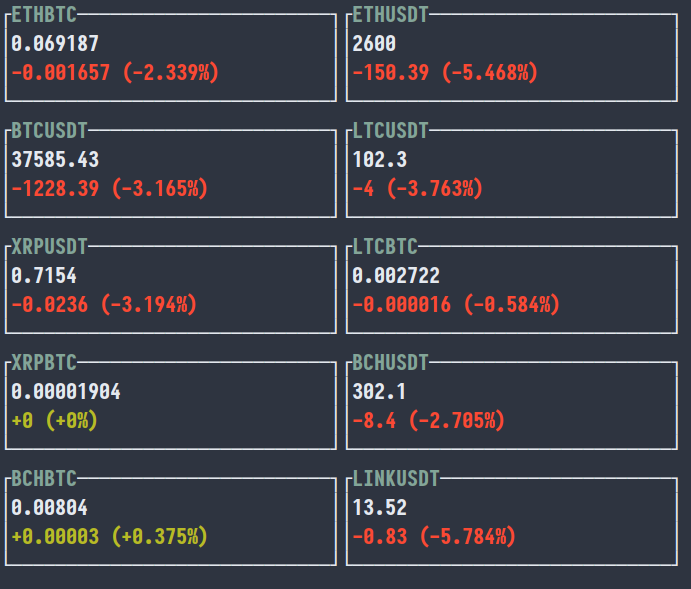
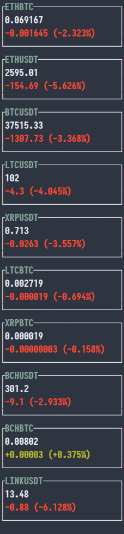
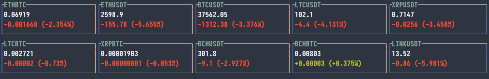

# coin-ticker

A CLI application that displays live Cryptocurrency market prices, sourced from [Binance](http://binance.com/).

## Usage

`$ ./coin-ticker --pairs btcusdt dogeusdt`

`$ ./coin-ticker --help`

## Compatibility

This project requires the latest Nightly Rust on account of relying on an [unstable language feature](https://doc.rust-lang.org/nightly/unstable-book/language-features/adt-const-params.html).

## License

Licensed under either of the following at your choosing:

- Apache License, Version 2.0 ([LICENSE-APACHE](LICENSE-APACHE) or http://www.apache.org/licenses/LICENSE-2.0)
- MIT license ([LICENSE-MIT](LICENSE-MIT) or http://opensource.org/licenses/MIT)
